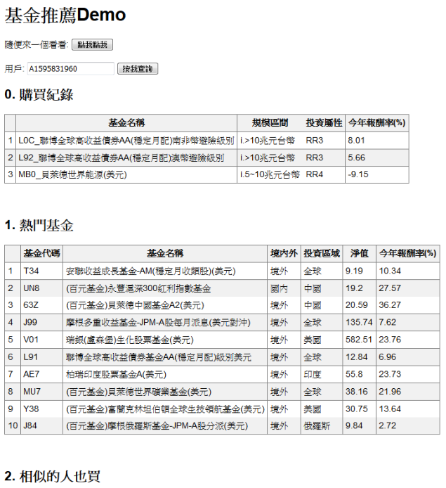

基金交易推薦
======

- [x] 利用交易資料產生三種推薦方法
    - 熱門商品(popular)
    - 用戶為基礎(user-based collaborative filtering)   
    - 用戶基礎 + 特徵篩選 (features blending ubcf)

- [x] 加入推薦理由
    - 抽取基金特徵與已購買的基金特徵比對，呈現用戶**喜歡的特徵**

- [ ] 加入基金特徵(物品的side-information)
- [ ] 加入內容特徵(Content based)
    

